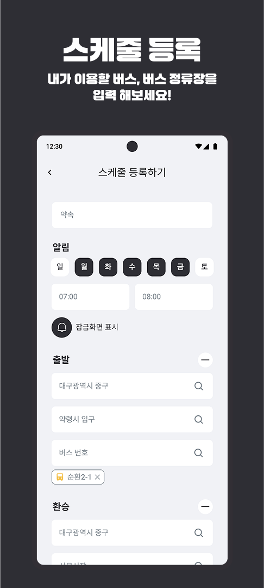
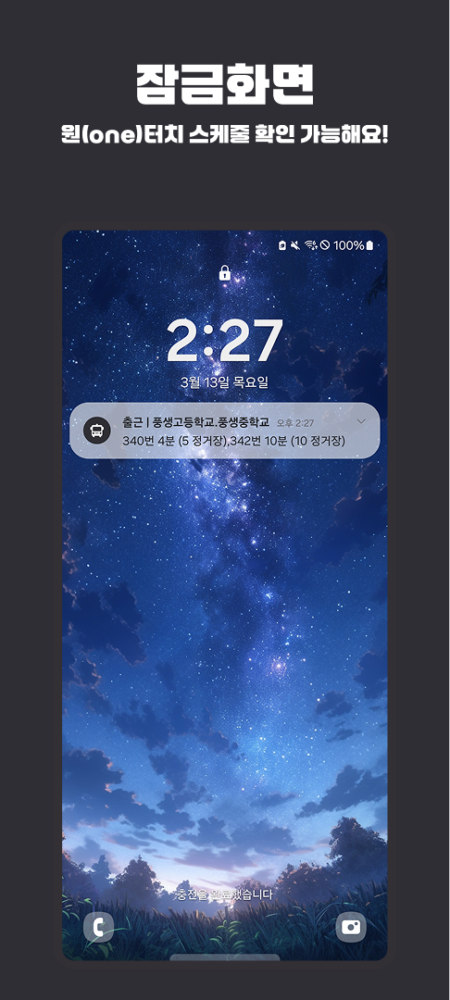

### TITI - 스케줄 기반 교통 정보 조회 서비스

  <h1>TITI - 스케줄 기반 교통 정보 조회 서비스</h1>
  
🔍 스케줄 기반 교통 정보 조회 서비스 🔍

 

  

 
---

## ✍️ 프로젝트 개요

- **프로젝트명:** TITI
- **프로젝트 기간:** 2025.01 ~ 
- **프로젝트 형태:** 일반 프로젝트
- **목표:** 기존에 교통 정보 확인을 위해 별도의 앱을 들어가야 했던 불편함을 해결하고, 스케줄의 교통 정보를 알림, 위젯 등으로 편리하게 조회할 수 있는 서비스 개발
- **주요 타겟 사용자:** 대중 교통을 사용하는 모든 사용자

---

## ✍️ 프로젝트 소개

### 프로젝트 배경

사용자가 자신의 스케줄을 수행하기 위해 교통 정보를 확인할 때, 다음과 같은 문제점이 있었습니다.

**비효율적인 교통 정보 탐색:** 
- 네이버 앱이나, 카카오 맵을 켜서 출발지와 도착지를 직접 설정해야 함
- 새로 고침을 통해 매번 새로운 정보를 수동으로 업데이트 해야 함

**TITI**는 위 문제를 해결하기 위해 사용자가 스케줄과 해당 스케줄에서 탑승할 버스정류장 및 버스 정보를 입력하면, 해당 스케줄의 시간대에 해당하는 교통편의 도착 정보를 알림, 위젯 등으로 한눈에, 편리하게 조회할 수 있는 서비스입니다.

---

### 문제점 해결

- **효율적인 교통 정보 탐색:** 기존에 일일이 앱을 들어가서 검색해야 했던 불필요함을 줄일 수 있습니다.

---

## 🚀 프로젝트 목표

1. **교통 정보 탐색 효율성 향상:** 
   - 스케줄과 교통편 정보를 한 번만 등록하면 됨.
   - 현재 스케줄에 해당하는 시간대의 스케줄의 교통정보를 실시간으로 안내받음.

2. **사용자 경험 강화:** 
   - 직관적이고 간편한 알림 및 위젯 서비스 제공.
   - 피드백 기능을 통해 지속적인 서비스 개선.

3. **확장 가능성 확보:** 
   - 버스 교통 정보 뿐 아니라, 지하철 등 다양한 교통 정보를 조회하도록 발전시킬 수 있음.
---

## 📌 주요 기능

### **0. 회원가입 | 로그인**

#### **회원가입**

- 닉네임 | 비밀번호

#### **로그인**

- 닉네임 | 비밀번호

### **1. 스케줄 등록**

- **기능 설명:** 사용자가 스케줄 정보(요일, 시간대 등)와 탑승할 버스정류장 및 버스 노선 정보를 입력합니다.

    
    
    

- **기술 요소:**
    - **KaKao Map API:** 카카오 맵 API 를 사용하여 버스정류장 마커 생성

---

### **2. 스케줄 조회**

- **기능 설명:** 메인 페이지를 요일별 스케줄 목록과, 스케줄 클릭 시 상세 정보를 확인할 수 있습니다. 

### **3. 알림 및 위젯 조회**

- **기능 설명:** 현재 시간대의 스케줄이 존재할 때 등록된 교통 정보의 도착 정보를 알림 및 위젯으로 조회할 수 있습니다.
   

### **4. 사용자 문의 페이지**

- **기능 설명:** 사용자는 문의 페이지를 통해 운영자에게 피드백 및 오류 정보를 전달할 수 있습니다.

---

## 🧑‍💻 팀원 소개

| **이름**    | **역할**        | 
|:-----------:|:---------------:|
| 김동현      | BE              | 
| 정대영      | AOS             |
| 정지현      | DESIGN          | 

---

## ⚙️ 기술 스택

<table>
  <thead>
    <tr>
      <th>분류</th>
      <th>기술 스택</th>
    </tr>
  </thead>
  <tbody>
    <tr>
      <td>백엔드</td>
      <td>
        
        
        
      </td>
    </tr>
    <tr>
      <td>데이터베이스</td>
      <td>
        
        
      </td>
    </tr>
    <tr>
      <td>인프라</td>
      <td>
        
        
        
      </td>
    </tr>
  </tbody>
</table>

---

## 📂 문서 자료

---
